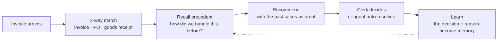
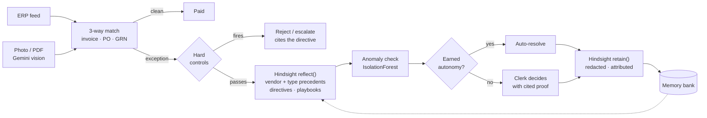
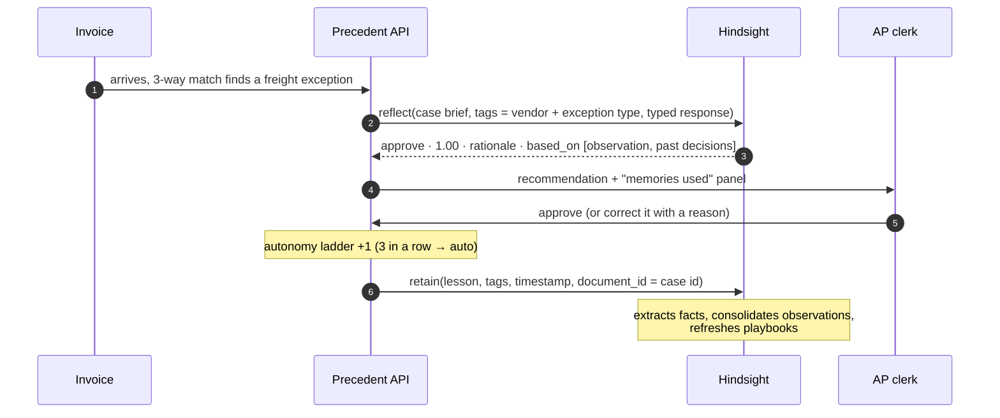

<div align="center">

<h1>
  <picture>
    <source media="(prefers-color-scheme: dark)" srcset="docs/assets/title-dark.svg">
    
  </picture>
</h1>

### The accounts-payable agent that learns from every invoice exception it resolves

*Built on **Hindsight** agent memory · HackwithHyderabad 3.0 · Team **Claude_Coders4***

**With memory, its recommendations match the AP clerk 96% of the time. Without memory, 35%.**

</div>

---

We're **team Claude_Coders4**, and this is **Precedent**: an AI agent for the accounts-payable (AP) team that gets better with every invoice problem it helps solve. This page walks you through the problem we picked, what we built, how it uses Hindsight memory, and the numbers that show it works. Everything described here is running code, and every number comes from an evaluation you can reproduce.

### Problem
Finance teams solve the same invoice problems again and again. The know-how sits in a few senior clerks' heads, and both rule-based software and stateless AI forget it.

### Our solution
Precedent checks every invoice, recalls how the team handled similar cases before using Hindsight memory, recommends a decision **with the past cases as proof**, and learns from every decision a human makes.

### The twist
It **earns autonomy**. Once it has been right often enough for a vendor, it resolves those invoices on its own. Hard financial controls stay in code, where memory can never override them.

### The proof
We replayed 26 weeks of invoices. With memory, our agent matched the clerk's decision **96%** of the time, against **35%** without it. It resolved **55%** of exceptions by itself and made **zero** wrong payments.

## Contents

[The problem](#the-problem) · [What Precedent does](#what-precedent-does) · [Memory is the star](#memory-is-the-star) · [Results](#results) · [The demo](#the-demo-in-five-acts) · [How it works](#how-it-works) · [Hindsight features](#every-hindsight-feature-we-use) · [Safety](#safety-and-trust) · [Highlights](#highlights-at-a-glance) · [Run it](#run-it-yourself) · [Tech stack](#tech-stack) · [Team](#team)

---

## The problem

Let us introduce **Priya**. She's an accounts-payable clerk at a mid-size manufacturer in Hyderabad, and every month she checks around 1,000 supplier invoices before they are paid.

Each invoice goes through a **3-way match**. It is compared with the **purchase order** (PO: what the company agreed to buy, and at what price) and the **goods receipt note** (GRN: what actually arrived at the warehouse). When all three agree, the invoice is paid. When they don't, it becomes an **exception** that someone has to resolve.

What frustrated us when we studied this workflow is that **the same exceptions keep coming back**:

| Vendor habit | What Priya has to remember |
|---|---|
| A steel supplier always adds freight as a separate line | "We agreed freight is fine up to ₹5,000 per trip" |
| A chemicals trader's prices creep up | "Their contract allows a 2.5% escalation, nothing more" |
| A polymer supplier's deliveries come up short in the monsoon | "Moisture loss of 2–5% is normal; pay for what arrived" |
| A packaging vendor still charges 18% GST on boxes | "It's 5% after GST 2.0; send it back" |
| The electricity bill never has a PO | "Utilities are fine without a PO if the amount is normal" |

None of this is written down. When Priya is on leave or changes jobs, the knowledge leaves with her. And today's tools don't help:

- **ERP matching rules** flag the mismatch but can't learn the answer, and someone in IT has to hand-write every rule.
- **Invoice-reading (OCR) tools** read the invoice but don't know how exceptions are resolved.
- **Chat assistants** are stateless: every decision is forgotten as soon as it's made.

The cost is real: slow payments, missed early-payment discounts, inconsistent decisions, and exposure to **duplicate payments and bank-detail fraud**.

## What Precedent does

We built an agent that works alongside Priya in a simple loop:



1. **Match.** Every invoice is checked line by line against its PO and goods receipt. Mismatches become exceptions, sorted into 10 types: price, quantity, freight, GST, rounding, missing PO, and four fraud and approval controls.
2. **Recall.** For each exception, Precedent asks Hindsight: *how did our team resolve this vendor's cases, and this type of exception, before?*
3. **Recommend.** It proposes **approve**, **approve a corrected amount**, **hold**, **reject** or **escalate**, with a confidence score and the exact memories it relied on.
4. **Learn.** Priya approves in one click, or corrects it and says why. That decision goes back into memory, so the next similar case is handled better.

**Earned autonomy.** Every *vendor × exception type* pair starts in *suggest* mode. After **3 correct recommendations in a row** it is promoted to **auto**, and Precedent resolves those cases by itself. **A single mistake** demotes it again. We also cap autonomy: the agent never pays more than a human has already approved for that pair.

> [!IMPORTANT]
> **Memory can never override a hard control.** Duplicate invoices, bank-account changes, first-time vendors and invoices over ₹5,00,000 are caught by plain code *before* any AI runs, and they always go to a human.

## Memory is the star

The quickest way to see what memory adds is to ask our agent about the same invoice twice: once without memory, once with it. These are **real outputs**, copied from our runs.

> **An invoice from Shree Balaji Steel** has a ₹4,200 freight line that isn't on the purchase order. Everything else matches.

| | Memory OFF (same LLM, no Hindsight) | Memory ON (Hindsight) |
|---|---|---|
| **Recommendation** | **Hold** · confidence 0.40 | **Approve** · confidence 1.00 |
| **Reasoning** | *"No prior precedent for freight charges not on PO; safest is to hold pending clarification."* | *"Precedents for Shree Balaji Steel Traders Pvt Ltd show that freight charges are approved when under the established cap of ₹5,000.00 per trip. The current charge of ₹4,200.00 falls within this threshold."* |
| **Evidence shown to the clerk** | None | 1 consolidated **observation** + 3 past approvals by Priya and Arjun |

### Watch it learn one vendor's rules

Here's how our agent picked up **Shree Balaji Steel**'s freight habit during the replay:

| Day | Freight line | What the agent did | Outcome |
|---|---|---|---|
| 0 | ₹3,850 | *Hold* (no memory yet, confidence 0.40) | Priya overruled it: *"our agreement covers freight up to ₹5,000 per trip"*, and that went into memory |
| 5 · 10 · 16 | ₹4,100 · ₹2,900 · ₹4,200 | *Approve* (confidence 1.00), citing Priya's decision | Accepted 3 times in a row, so it was **promoted to auto** |
| **23** | **₹7,400** | **Auto-hold**, because it's over the ₹5,000 cap | It learned the *limit*, not just "approve freight" |
| 30 | ₹3,300 | **Auto-approve** | Resolved with no human touch |
| 44 | ₹4,650 | *Approve*, but **not** automatically | Higher than any amount a human had approved, so a human confirmed it |

We never wrote a rule for "freight up to ₹5,000". The agent learned it from one sentence a clerk typed, applied it in both directions (approve under the cap, hold over it), and stayed within the amounts humans had signed off.

## Results

To measure this properly, we replayed **26 weeks** of invoices (**266 invoices, 140 exceptions, 25 vendors**) twice: once with Hindsight memory, and once with the **same LLM and no memory**. Months 1–4 build up memory, and months 5–6 are the measurement window.

<picture>
  <source media="(prefers-color-scheme: dark)" srcset="docs/assets/learning-curve-dark.svg">
  
</picture>

| Months 5–6 | Memory ON | Memory OFF |
|---|:---:|:---:|
| Recommendation matches the clerk's decision | **96%** | 35% |
| Exceptions resolved by the agent on its own | **55%** | 0% |
| Money wrongly approved by the agent | **0** | — |
| Cited memories that are about the same vendor or exception type | **87%** | — |

<details>
<summary><b>How we measured this</b></summary>

<br/>

We want these numbers to be easy to trust, so here is exactly how we got them:

- **"Matches"** means the same *payment outcome* as the clerk: pay in full, pay a corrected amount, or don't pay. Hold, escalate and reject all mean "don't pay"; they differ in workflow, not money.
- **The clerk is simulated.** It follows each invoice's ground-truth decision from our dataset generator. The agent **never sees** that ground truth; it only sees the documents and its memory.
- **Memory OFF resolves 0% on its own by design**, because autonomy requires memory-backed recommendations. The like-for-like comparison is therefore **96% vs 35%**.
- **Citation relevance (87%)** is measured over the 131 memories cited in weeks 1–8: the share that mention the same vendor or the same exception type.
- **Money wrongly approved** counts auto-resolutions that paid out when the correct decision was not to pay. Every auto-resolution is audited during the replay.
- **It's reproducible.** `uv run python -m scripts.build_demo` rebuilds the whole run, and the raw numbers are in [`backend/data/eval.json`](backend/data/eval.json).

</details>

## The demo in five acts

Our live demo tells the story in five short acts. It runs on a simulated calendar, and each act loads instantly from a prebuilt snapshot of the database and the memory bank.

| Act | What you'll see |
|---|---|
| **1**&nbsp;·&nbsp;**Day&nbsp;1** | A brand-new agent. Balaji's invoice has an unexpected ₹3,850 freight line. With no memory, the agent can only say *hold*. Priya approves it and types why. |
| **2**&nbsp;·&nbsp;**Week&nbsp;3** | A similar invoice arrives. The agent says **approve (1.00)**, quotes the ₹5,000 cap and shows Priya's decision as proof. One click, and Balaji × freight is **promoted to autonomous**. Switch memory **off** and the same invoice drops back to a generic *hold*. |
| **3**&nbsp;·&nbsp;**Week&nbsp;8** | Balaji's freight invoices now resolve themselves. Four vendor × exception pairs have earned autonomy, and the dashboard shows the learning curve. |
| **4**&nbsp;·&nbsp;**The&nbsp;twist** | An invoice that looks routine asks for payment to a **new bank account**, and another is a **resubmitted duplicate**. Despite strong precedent, the hard controls escalate and reject them, citing the rule they enforce and the precedent they overrode. |
| **5**&nbsp;·&nbsp;**Snap&nbsp;a&nbsp;photo** | We photograph a paper invoice. Gemini vision reads it, it's matched against the PO, and it's **auto-resolved in about 14 seconds**. Upload the same photo again and it's caught as a **duplicate**. |

<p align="center">
  
  <br/><sub>The invoice we use in Act 5: a realistic GST tax invoice with a real-format GSTIN, CGST/SGST split and bank details.</sub>
</p>

## How it works

Under the hood, every invoice takes this path:



### The learning loop, step by step



### Decisions we made to keep it reliable

| Decision | Why it matters |
|---|---|
| **Plain code runs the workflow; AI only answers questions** | Matching, controls, autonomy and money arithmetic are deterministic and tested. The language models only ever return schema-validated JSON. |
| **Strict JSON, a repair retry, and three-provider failover** | Groq `gpt-oss-120b` → Gemini `3.1-flash-lite` → NVIDIA `nemotron-3-super`. Bad JSON gets one repair attempt; a rate limit or outage moves to the next provider. We saw this work for real when Groq's free tier hit its limit during our evaluation. |
| **Money is calculated in code, never by the model** | Corrected payable amounts come from the 3-way match. They match the clerk's amount within ₹1 on every adjusted case in our dataset. |
| **Graceful degradation** | If `reflect()` fails, we fall back to `recall()` + an LLM. If Hindsight is down, we fall back to the LLM alone, and `/api/health` reports it so the app can show a banner. |
| **Recommendations cached per case and memory mode** | Switching memory on and off in the demo is instant, and we never pay twice for the same answer. |
| **Live updates** | Server-Sent Events push new exceptions, auto-resolutions, lessons and autonomy promotions to the app the moment they happen. |

## Every Hindsight feature we use

Memory isn't a bolt-on for us; it's the core of the product. Here's every Hindsight feature Precedent uses, and where to find it in the code.

| Hindsight feature | How Precedent uses it | Code |
|---|---|---|
| **Memory bank + missions** | One AP-team bank. Its `retain_mission`, `observations_mission` and `reflect_mission` focus it on vendors, exact limits and decisions | [`memory/store.py`](backend/app/memory/store.py) |
| **`retain()`** | Every resolution becomes a lesson: vendor, exception, amounts, decision, the clerk's reason, and whether the agent was right | [`services/cases.py`](backend/app/services/cases.py) |
| **Tags + `document_id`** | `vendor:V001`, `exc:freight_charge` and `decision:approve` scope every read; one document per case means any lesson can be removed on its own | [`memory/store.py`](backend/app/memory/store.py) |
| **`reflect()` + `response_schema`** | Returns a typed recommendation, not free text | [`agent/recommender.py`](backend/app/agent/recommender.py) |
| **`based_on` (include facts)** | The exact memories, playbooks and directives used, shown to the clerk as proof | [`memory/store.py`](backend/app/memory/store.py) |
| **World + experience facts** | What the team did, *and* the agent's own track record ("recommended hold, was overruled") | automatic from `retain()` |
| **Observations** | Consolidated vendor habits, like *"Balaji freight is approved under ₹5,000 per trip"*, shown on the vendor profile | [`api/routes.py`](backend/app/api/routes.py) |
| **Directives** | 5 hard rules applied inside every `reflect()`: bank changes, duplicates, new vendors, the approval limit, and rules for evidence | [`memory/store.py`](backend/app/memory/store.py) |
| **Mental models** | A playbook for each vendor and a team-wide policy, refreshed as memory grows | [`memory/store.py`](backend/app/memory/store.py) |
| **Disposition + entity labels** | A sceptical, literal finance persona, plus a controlled vocabulary of exception types and decisions | [`memory/store.py`](backend/app/memory/store.py) |
| **`recall()`** | The fallback path, vendor profiles, and the precedent a hard control overrode | [`agent/recommender.py`](backend/app/agent/recommender.py) |
| **`clone_bank`** | Frozen memory snapshots for each demo act | [`scripts/build_demo.py`](backend/scripts/build_demo.py) |
| **Documents API (`delete_document`)** | Forgetting a wrong lesson completely | [`memory/store.py`](backend/app/memory/store.py) |

We've written up the full memory design, with examples, in **[`docs/HINDSIGHT.md`](docs/HINDSIGHT.md)**.

## Safety and trust

An agent that approves payments has to stay safe even when someone teaches it the wrong thing. We built six layers of protection:

1. **Hard controls are code.** Duplicates, bank-detail changes, first-time vendors and invoices over ₹5,00,000 are always escalated or rejected, whatever memory says.
2. **Autonomy stays inside proven limits.** The agent only pays automatically up to the largest amount a human has already approved for that vendor and exception type.
3. **Unusual invoices slow it down.** A per-vendor **IsolationForest** model flags invoices that don't look like the vendor's history. Confidence drops, and autonomy is blocked for that invoice.
4. **Every lesson is attributed and reversible.** The lessons list shows who taught what. `POST /api/lessons/{id}/revoke` deletes the lesson from Hindsight (we tested it live: 2 extracted facts went to 0), resets that vendor × type to *suggest*, and discards recommendations built on it.
5. **Personal data never reaches memory.** Phone numbers, bank account numbers, PAN, Aadhaar, card numbers, emails and UPI IDs are redacted before anything is stored. GSTINs, IFSC codes and invoice numbers are kept, because the business needs them.
6. **Auto-resolutions are audited.** If an audit disagrees with the agent, that pair is demoted immediately.

## Highlights at a glance

If you only have a minute, here's how we'd sum up what we delivered in each area.

| Criterion | Evidence |
|---|---|
| **Innovation** | Not another chatbot: an agent that **earns autonomy** per vendor and exception type, capped by amounts humans have already approved · a problem most teams won't pick (AP exception handling, a real finance function) · **a photo of a paper invoice, auto-resolved in about 14 seconds** · memory that learns *limits*, not just approvals (the ₹7,400 auto-hold) |
| **Use of Hindsight Memory** | Memory *is* the product: **96% vs 35%** with and without it · 13 Hindsight features in use (see the table above), from `reflect` with typed output and `based_on` citations to observations, directives, mental models, `clone_bank` and document deletion · the agent visibly improves: *hold* on Day 1, *approve* with proof in Week 3, autonomous by Week 8 · full write-up in [`docs/HINDSIGHT.md`](docs/HINDSIGHT.md) |
| **Technical Implementation** | About 5,000 lines of typed Python · **26 automated tests**, including one that checks the matcher against all 266 invoices, regression tests for the bugs we found in live runs, and a fake memory and LLM so the tests cost nothing · deterministic controls before any AI · three-provider LLM failover, proven under a real rate limit · money calculated in code · graceful degradation · a reproducible evaluation |
| **User Experience** | Every recommendation explains itself with cited precedents · one-click approve, or correct it with a reason · live updates over SSE · instant demo acts and an instant memory on/off switch · invoice photo capture · push notifications for blocked and auto-resolved invoices |
| **Real-world Impact** | Solves an everyday finance problem that companies already pay to fix, clearing the *"would someone pay $50/month?"* test · keeps institutional knowledge when staff leave · catches duplicates and bank-detail fraud · built for India from day one (GSTIN, GST 2.0 rates, HSN codes, INR) · a natural path to adoption as an ERP add-on for shared-services finance teams |

## Run it yourself

Want to try it? Here's how to run Precedent on your own machine.

**You'll need:** Python 3.12, [uv](https://docs.astral.sh/uv/), a Hindsight Cloud API key, and at least one LLM key (Groq, Gemini or NVIDIA).

```bash
cd backend
cp .env.example .env            # add HINDSIGHT_API_KEY, GROQ_API_KEY, GEMINI_API_KEY, NVIDIA_API_KEY
uv sync                         # install dependencies
uv run fastapi dev app/main.py  # API + interactive docs at http://localhost:8000/docs
```

On first start, the API loads the dataset and opens **Act 1 (Day 1)**. You can move through the demo with:

```bash
curl -X POST localhost:8000/api/demo/advance -H "content-type: application/json" -d '{"stage":"week3"}'
# stages: day1 · week3 · week8 · twist        reset: POST /api/demo/reset
```

| Command | What it does |
|---|---|
| `uv run pytest` | Runs the 26 offline tests (no network, no cost) |
| `uv run python -m scripts.smoke --days 10` | A live smoke test against Hindsight and the LLMs |
| `uv run python -m scripts.build_demo` | Rebuilds every demo snapshot and the memory ON/OFF evaluation (about 20 minutes, live APIs) |
| `uv run python -m scripts.gen_vapid` | Creates push-notification keys |
| `uv run python -m scripts.make_charts` | Redraws the learning-curve chart from the evaluation |

<details>
<summary><b>API overview (22 endpoints)</b></summary>

<br/>

The full contract, with a mock response for every endpoint, is in [`docs/api-contract.md`](docs/api-contract.md) and [`docs/mocks/`](docs/mocks/).

| Area | Endpoints |
|---|---|
| Exceptions | `GET /api/exceptions` · `GET /api/exceptions/{id}` · `POST /api/exceptions/{id}/recommend` · `POST /api/exceptions/{id}/resolve` |
| Memory | `GET /api/memory/recent` · `GET /api/memory/policy` · `GET /api/lessons` · `POST /api/lessons/{id}/revoke` · `POST /api/copilot/ask` |
| Vendors and autonomy | `GET /api/vendors` · `GET /api/vendors/{id}` · `GET /api/autonomy` |
| Capture | `POST /api/invoices/capture` (photo or PDF) |
| Dashboard | `GET /api/metrics` |
| Demo | `GET /api/demo/state` · `POST /api/demo/advance` · `POST /api/demo/reset` |
| Platform | `GET /api/health` · `GET/PATCH /api/settings` · `GET /api/events` (SSE) · push subscription |

</details>

<details>
<summary><b>The data: synthetic, but built to look real</b></summary>

<br/>

We generate the data from a fixed seed, so every run is identical:

- **25 vendors across 8 Indian states**, with valid, checksummed **GSTINs**, IFSC codes and masked bank accounts
- **Real HSN/SAC codes** and **GST 2.0 rates** (5% / 18%)
- **233 purchase orders and goods receipts** and **266 invoices** over 26 weeks (March–August 2026)
- **Recurring vendor habits:** separate freight lines, price-escalation clauses, monsoon transit loss, partial shipments billed in full, the old GST rate still being charged, no-PO utility bills, fuel surcharges
- **Traps:** duplicate submissions, bank-account-change fraud attempts, a first-time vendor, and invoices over the approval limit

Our matching engine independently finds **exactly** the issues the generator planted, on all 266 invoices, and that check is part of the test suite.

</details>

<details>
<summary><b>Repository map</b></summary>

<br/>

```text
backend/
  app/
    data/         seeded dataset generator + vendor catalog
    matching/     3-way match engine
    guardrails/   hard financial controls
    memory/       Hindsight wrapper + personal-data redaction
    llm/          OpenAI-compatible router with failover
    ml/           per-vendor anomaly scoring
    agent/        recommender + earned-autonomy ladder
    services/     case lifecycle, simulator, demo stages, metrics, capture, push
    api/          FastAPI routes
  scripts/        demo builder, charts, smoke test, sample invoice, VAPID keys
  tests/          26 offline tests with a fake memory and fake LLM
  data/           demo snapshots + evaluation results
frontend/         Progressive Web App
docs/             Hindsight write-up, API contract, mocks, charts, sample invoice
```

</details>

## Tech stack

For reference, here's everything we built Precedent with, and why we chose it.

| Layer | Technology | Why we chose it |
|---|---|---|
| **Agent memory** | Hindsight Cloud (`hindsight-client`) | Retain, recall and reflect with tags, directives, observations and mental models: the heart of the product |
| **Backend** | Python 3.12 · FastAPI · Pydantic v2 · SQLModel + SQLite · uv | Typed end to end; FastAPI serves REST and live Server-Sent Events from one app |
| **Language models** | Groq `openai/gpt-oss-120b` → Google Gemini `gemini-3.1-flash-lite` → NVIDIA `nemotron-3-super-120b-a12b` | One OpenAI-compatible router with automatic failover, so a rate limit never stops the agent |
| **Vision** | Gemini `gemini-3.1-flash-lite` | Reads a photo or PDF of a paper invoice into a typed invoice in about 4 seconds |
| **Machine learning** | scikit-learn IsolationForest | A per-vendor anomaly score that lowers confidence on unusual invoices |
| **Frontend** | Progressive Web App: Vite · React 19 · TypeScript · Tailwind v4 · shadcn/ui | Installs like a native app, is designed desktop-first but works on mobile, and can receive push notifications |
| **Notifications** | Web Push (VAPID) | Alerts for blocked and auto-resolved invoices |
| **Quality** | pytest · ruff · API contract generated from the Pydantic models | 26 offline tests; the frontend's types come straight from the backend |

## What's next

If we keep building after the hackathon, this is where we'd take Precedent:

- **ERP connectors** (Tally, SAP, Zoho Books), so invoices, POs and goods receipts flow in automatically
- **Four-eyes approval for lessons**, so a high-impact lesson needs an AP lead's sign-off before it becomes memory
- **One memory bank per company** in a shared-services centre, with team-level policies
- **Early-payment discount optimisation**, using the time Precedent saves

## Team

We're **Claude_Coders4**, building for HackwithHyderabad 3.0.

| Member | Role | GitHub |
|---|---|---|
| **Nagashivashankar Kaki** | Team Leader · Backend, AI & Memory | [@Eldorado5002](https://github.com/Eldorado5002) |
| **Rupesh Seku** | Frontend (PWA) | [@srupesh08](https://github.com/srupesh08) |
| **Sameeksha Kasha** | Testing & Documentation | [@Sameeksha270905](https://github.com/Sameeksha270905) |
| **Vyshnavi Kolipyaka** | Demo Video & Content | [@vyshu2202](https://github.com/vyshu2202) |

<div align="center">
<br/>

Thanks for reading.

*The database records what happened. **Hindsight stores what the team has learned.***

</div>
