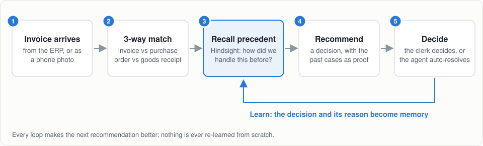
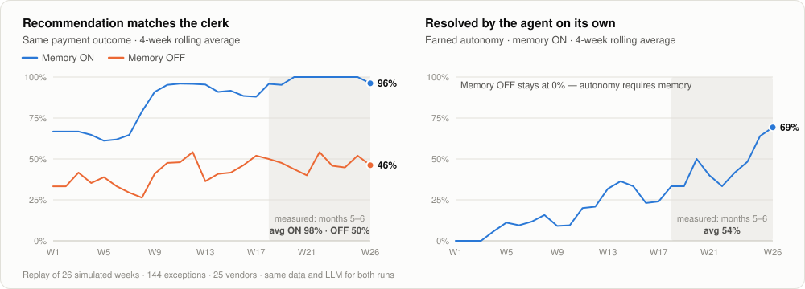
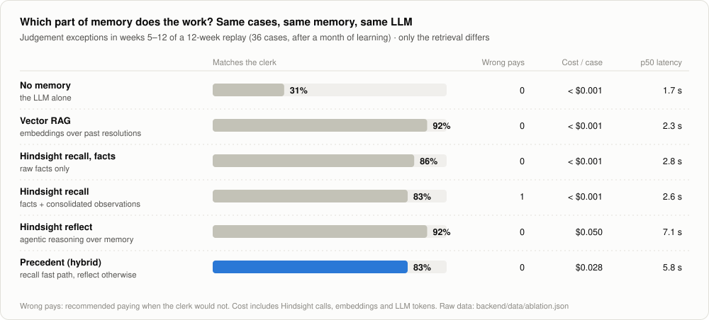
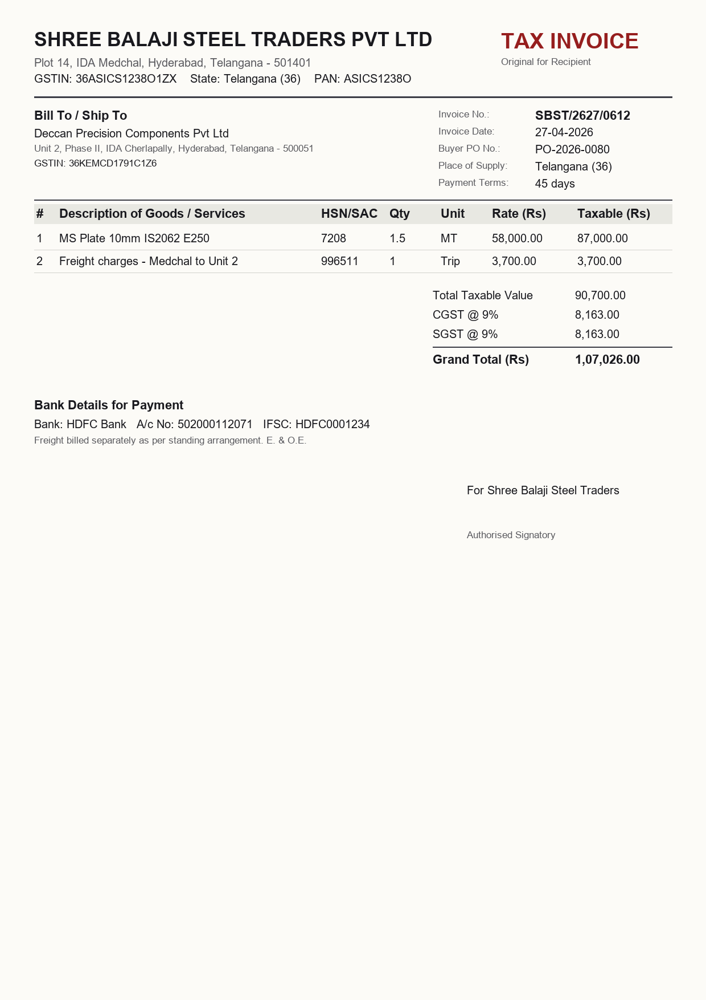
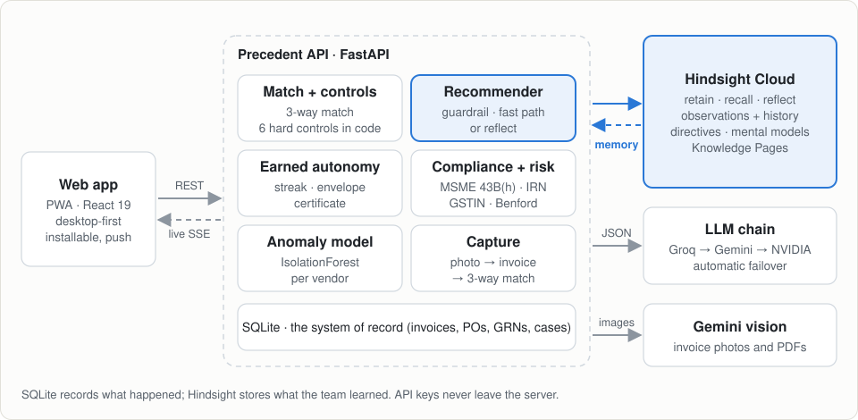
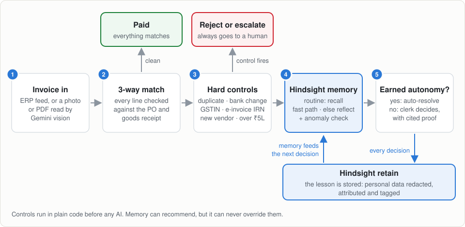
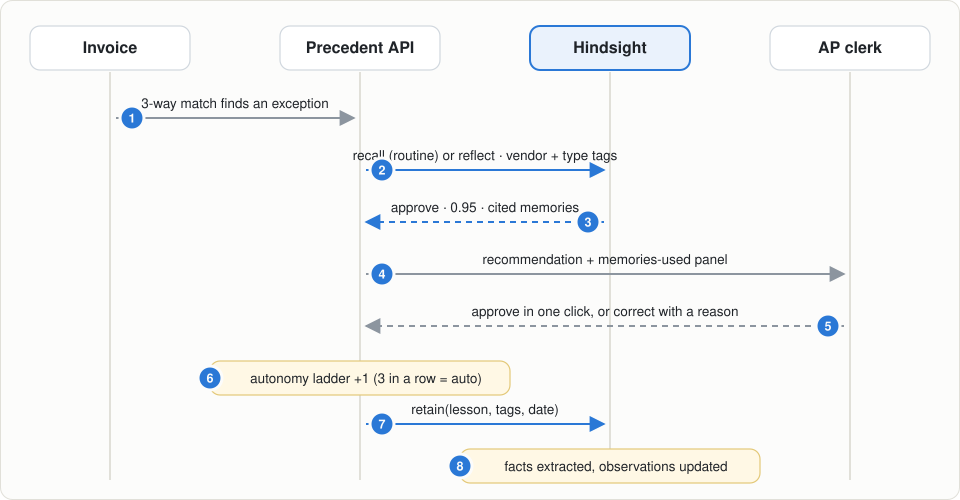

<div align="center">

<h1>
  <picture>
    <source media="(prefers-color-scheme: dark)" srcset="docs/assets/title-dark.svg">
    
  </picture>
</h1>

### The accounts-payable agent that learns from every invoice exception it resolves

*Built on **Hindsight** agent memory · HackwithHyderabad 3.0 · Team **Claude_Coders4***

**With memory, its recommendations match the AP clerk 98% of the time. Without memory, 50%.**

**0 wrong payments** · **Certified autonomy** · **Built for Indian AP** · **$17 per 1,000 exceptions**

</div>

---

We're **team Claude_Coders4**, and this is **Precedent**: an AI agent for the accounts-payable (AP) team that gets better with every invoice problem it helps solve. This page walks you through the problem we picked, what we built, how it uses Hindsight memory, and the numbers that show it works. Everything described here is running code, and every number comes from an evaluation you can reproduce.

### Problem
Finance teams solve the same invoice problems again and again. The know-how sits in a few senior clerks' heads, and both rule-based software and stateless AI forget it.

### Our solution
Precedent checks every invoice, recalls how the team handled similar cases before using Hindsight memory, recommends a decision **with the past cases as proof**, and learns from every decision a human makes. It is built for Indian AP from the ground up: MSME payment deadlines, GST e-invoices and GSTIN checks.

### The twist
It **earns autonomy**, and it has to **prove it statistically**. Once it has been right often enough for a vendor, it resolves those invoices on its own, but only at a confidence level where the evidence guarantees fewer than 5% wrong payments. Hard financial controls stay in code, where memory can never override them.

### The proof
We replayed 26 weeks of invoices. With memory, our agent matched the clerk's decision **98%** of the time, against **50%** without it. It resolved **54%** of exceptions by itself and made **zero** wrong payments.

## Why Precedent is different

1. **Proven, not claimed.** Three reproducible evaluations: a 26-week replay with and without memory, an ablation study of six ways to use memory, and invoice capture tested on 50 real scanned invoices. → [Results](#results)
2. **A statistical safety guarantee.** The agent pays on its own only where an exact Clopper–Pearson bound shows that fewer than 5% of payments can be wrong. By the end of the replay it was certified on 73 human-verified payment decisions with no errors. → [Trust you can check](#trust-you-can-check)
3. **Memory that learns limits and shows its beliefs.** From one sentence a clerk typed, it learned "freight up to ₹5,000 per trip", approving under the cap and holding over it. Every belief shows the evidence behind it and how it changed, and a vendor wiki writes itself. → [Memory is the star](#memory-is-the-star)
4. **Built for India.** Section 43B(h) payment deadlines for MSME suppliers, GST e-invoice IRNs, GSTIN validation and GST 2.0 rates. → [Built for India](#built-for-india)
5. **Cheap enough to run every day.** Routine cases take a fast path, so memory and models cost about $17 per 1,000 exceptions, with a median answer in 2.7 seconds. → [How it works](#how-it-works)

## Contents

| The story | How it's built | Reference |
|---|---|---|
| 1. [The problem](#the-problem) | 7. [How it works](#how-it-works) | 12. [Run it yourself](#run-it-yourself) |
| 2. [What Precedent does](#what-precedent-does) | 8. [Every Hindsight feature we use](#every-hindsight-feature-we-use) | 13. [Tech stack](#tech-stack) |
| 3. [Memory is the star](#memory-is-the-star) | 9. [Safety and fraud](#safety-and-fraud) | 14. [What's next](#whats-next) |
| 4. [Built for India](#built-for-india) | 10. [Highlights at a glance](#highlights-at-a-glance) | 15. [Team](#team) |
| 5. [Results](#results) | 11. [Limitations](#limitations) | |
| 6. [The demo in five acts](#the-demo-in-five-acts) | | |

---

## The problem

Let us introduce **Priya**. She's an accounts-payable clerk at a mid-size manufacturer in Hyderabad, and every month she checks around 1,000 supplier invoices before they are paid.

Each invoice goes through a **3-way match**. It is compared with the **purchase order** (PO: what the company agreed to buy, and at what price) and the **goods receipt note** (GRN: what actually arrived at the warehouse). When all three agree, the invoice is paid. When they don't, it becomes an **exception** that someone has to resolve.

What frustrated us when we studied this workflow is that **the same exceptions keep coming back**:

| Vendor habit | What Priya has to remember |
|---|---|
| A steel supplier always adds freight as a separate line | "We agreed freight is fine up to ₹5,000 per trip" |
| A chemicals trader's prices creep up | "Their contract allows a 2.5% escalation, nothing more" |
| A polymer supplier's deliveries come up short in the monsoon | "Moisture loss of 2–5% is normal; pay for what arrived" |
| A packaging vendor still charges 18% GST on boxes | "It's 5% after GST 2.0; send it back" |
| The electricity bill never has a PO | "Utilities are fine without a PO if the amount is normal" |

None of this is written down. When Priya is on leave or changes jobs, the knowledge leaves with her. And today's tools don't help:

- **ERP matching rules** flag the mismatch but can't learn the answer, and someone in IT has to hand-write every rule.
- **Invoice-reading (OCR) tools** read the invoice but don't know how exceptions are resolved.
- **Chat assistants** are stateless: every decision is forgotten as soon as it's made.

The cost is real: slow payments, missed early-payment discounts, inconsistent decisions, exposure to **duplicate payments and bank-detail fraud**, and in India, **lost tax deductions** when small suppliers are paid late.

## What Precedent does

We built an agent that works alongside Priya in a simple loop:

<picture>
  <source media="(prefers-color-scheme: dark)" srcset="docs/assets/diagram-loop-dark.svg">
  
</picture>

1. **Match.** Every invoice is checked line by line against its PO and goods receipt. Mismatches become exceptions, sorted into 12 types: price, quantity, freight, GST, rounding, missing PO, and six fraud, compliance and approval controls.
2. **Recall.** For each exception, Precedent asks Hindsight: *how did our team resolve this vendor's cases, and this type of exception, before?*
3. **Recommend.** It proposes **approve**, **approve a corrected amount**, **hold**, **reject** or **escalate**, with a confidence score and the exact memories it relied on.
4. **Learn.** Priya approves in one click, or corrects it and says why. That decision goes back into memory, so the next similar case is handled better.

**Earned autonomy, with a certificate.** Every *vendor × exception type* pair starts in *suggest* mode. After **3 correct recommendations in a row** it is promoted to **auto**, and **a single mistake** demotes it again. The agent never pays more than a human has already approved for that pair. On top of that, a statistical **autonomy certificate** decides how sure a payment recommendation must be before it may be automatic, so that with 95% confidence fewer than 5% of automatic payments are wrong. Until there is enough evidence, only recommendations at confidence 0.95 or higher qualify.

> [!IMPORTANT]
> **Memory can never override a hard control.** Duplicate invoices (including reformatted or resubmitted invoice numbers), bank-account changes, a GSTIN that fails its checksum or doesn't match the vendor, a missing e-invoice IRN, first-time vendors and invoices over ₹5,00,000 are caught by plain code *before* any AI runs, and they always go to a human.

## Memory is the star

The quickest way to see what memory adds is to ask our agent about the same invoice twice: once without memory, once with it. These are **real outputs** from the Week 3 snapshot of our demo.

> **An invoice from Shree Balaji Steel** has a ₹4,200 freight line that isn't on the purchase order. Everything else matches.

| | Memory OFF (same LLM, no Hindsight) | Memory ON (Hindsight) |
|---|---|---|
| **Recommendation** | **Hold** · confidence 0.40 | **Approve** · confidence 0.95 |
| **Reasoning** | *"The freight charge is not present on the purchase order, and there is no established precedent or contract terms provided to authorize unlisted charges."* | *"The team has a consistent precedent for Shree Balaji Steel Traders Pvt Ltd (V001) to approve freight charges that are ₹5,000 or less per trip, even when not on the purchase order. The current freight charge of ₹4,200.00 is within this ₹5,000.00 cap."* |
| **Evidence shown to the clerk** | None | 1 consolidated **observation**, 4 past decisions by Priya, Arjun and Sneha, and 3 records of the agent's own track record |

### Watch it learn one vendor's rules

Here's how our agent picked up **Shree Balaji Steel**'s freight habit during the replay:

| Day | Freight line | What the agent did | Outcome |
|---|---|---|---|
| 0 | ₹3,850 | *Hold* (no memory yet, confidence 0.30) | Priya overruled it: *"our agreement covers freight up to ₹5,000 per trip"*, and that went into memory |
| 5 · 10 · 16 | ₹4,100 · ₹2,900 · ₹4,200 | *Approve* (1.00 · 1.00 · 0.95), citing Priya's decision | Accepted 3 times in a row, so it was **promoted to auto** |
| **23** | **₹7,400** | **Auto-hold** (0.90), because it's over the ₹5,000 cap | It learned the *limit*, not just "approve freight" |
| 30 · 51 | ₹3,300 · ₹3,600 | **Auto-approve** | Resolved with no human touch |
| 44 | ₹4,650 | *Approve* (0.95), but **not** automatically | Higher than any amount a human had approved, so a human confirmed it |

We never wrote a rule for "freight up to ₹5,000". The agent learned it from one sentence a clerk typed, applied it in both directions (approve under the cap, hold over it), and stayed within the amounts humans had signed off.

### What the agent believes, and why

Hindsight consolidates lessons into **beliefs**. Precedent shows each one with the memories behind it and how it changed over time, so a clerk can check *why* the agent thinks what it thinks. These two are about Balaji, from the end of the 26-week run:

| Belief | Evidence | How it changed |
|---|---|---|
| *"…freight charges are approved by the team when they are ₹5,000 or less per trip…"* | 32 memories: decisions by Priya, Arjun, Sneha and Rahul, and the agent's own audited ones | Revised 20 times as new approvals arrived; the limit never moved |
| *"…a standing agreement limit of ₹5,000.00 for freight charges per trip; charges exceeding this amount are not on the purchase order and require a hold…"* | 2 memories: the ₹7,400 and ₹8,200 holds | Gained its second example when the agent held an ₹8,200 freight line |

### A vendor wiki that writes itself

Each vendor's profile carries a page that **nobody on our team wrote**. Hindsight generates it from the team's lessons and rewrites it as they change. An excerpt from Balaji's page:

> *"The team maintains a standing agreement limit for freight charges of ₹5,000.00 per trip for this vendor. Charges up to and including this limit per trip are generally approved. Charges exceeding this amount are considered outside the purchase order and require a hold."*

The same page lists the team-wide rules that apply to every Balaji invoice: the approval limit, bank changes, duplicates, GSTIN checks and e-invoicing.

## Built for India

AP in India has rules that generic tools ignore. We built them in from the start:

| Rule | What it requires | What Precedent does | Where you see it |
|---|---|---|---|
| **MSME payments, Section 43B(h)** | Pay micro and small suppliers registered on Udyam within 15 days of accepting the goods (45 with a written agreement), or the expense can't be deducted that year | Tracks each deadline from the goods-receipt date, estimates the tax at stake at the 25.17% corporate rate, and warns on every hold or escalation | Queue sorted by MSME deadline, a days-left badge, a dashboard KPI |
| **GST e-invoicing** | Suppliers above ₹5 crore turnover must issue invoices registered with an IRN; without one it isn't a valid tax invoice | Holds the invoice until an IRP-registered version arrives (a hard control) | Act 5: the photo without an IRN is held |
| **GSTIN validation** | Every supplier's GSTIN encodes its state and PAN and ends in a check digit | Verifies the mod-36 checksum and compares it with the vendor master; a mismatch is escalated as possible impersonation | Act 5: the photo with a tampered GSTIN is escalated |
| **GST 2.0 rates and HSN codes** | 5% and 18% slabs, set by HSN/SAC code | Real codes and rates in every invoice; flags a vendor still charging the old rate | Tax-mismatch exceptions |
| **Personal data** | Aadhaar, PAN, UPI IDs and phone numbers are sensitive | Redacted from the clerk's notes before anything reaches memory | The lesson text stored in Hindsight |

In the demo's Twist stage, sorting the queue by MSME deadline puts a micro supplier's invoice first: **5 days** from its 43B(h) deadline, with **₹46,476** of tax deduction at stake. The agent recommends paying it, because the ₹7 rounding difference is within the team's ₹10 tolerance.

## Results

To measure this properly, we replayed **26 weeks** of invoices (**576 invoices, 144 exceptions, 25 vendors**) twice: once with Hindsight memory, and once with the **same LLM and no memory**. Months 1–4 build up memory, and months 5–6 are the measurement window.

<picture>
  <source media="(prefers-color-scheme: dark)" srcset="docs/assets/learning-curve-dark.svg">
  
</picture>

| Months 5–6 | Memory ON | Memory OFF |
|---|:---:|:---:|
| Recommendation matches the clerk's decision | **98%** | 50% |
| Exceptions resolved by the agent on its own | **54%** | 0% |
| Money wrongly approved by the agent | **0** | — |
| Cited memories that are about the same vendor or exception type | **94%** | — |

### Trust you can check

By the end of the 26 weeks, the agent had earned more than good numbers. It had earned a guarantee.

| Over the full 26 weeks | Result |
|---|---|
| **Autonomy certificate** | **Certified** at confidence ≥ 0.75: 73 human-verified payment recommendations, 0 wrong. With 95% confidence the true wrong-payment rate is at most **4.0%** (target 5%) |
| **Automatic resolutions** | 46, all audited, 0 wrong |
| **Calibration** | Stated confidence tracks real accuracy: expected calibration error **0.07** over 123 decisions. Every recommendation carries both numbers |
| **Cost** | **$17 per 1,000 exceptions** with memory; 58% of cases take the fast path |
| **Speed** | Median recommendation in **2.7 s** (95th percentile 9.4 s) |
| **Time saved** | About **820 clerk-minutes** across 144 exceptions |

### Which part of memory does the work?

We wanted to know *why* memory helps, so we ran an ablation study. For 12 simulated weeks, every exception was answered six ways, all reading **the same memory at the same moment with the same LLM**. Only the way past decisions are retrieved differs.

<picture>
  <source media="(prefers-color-scheme: dark)" srcset="docs/assets/ablation-dark.svg">
  
</picture>

- **Memory is what matters.** Every way of using past decisions lifts accuracy from about a third to 83–92%, and nearly every remaining mistake is a cautious hold: one wrong payment in 318 answers.
- **`reflect` is the most accurate and the most expensive** ($0.05 and about 7 seconds a case). Our hybrid sends routine cases down a recall fast path (about $0.001), gives up a few cautious holds for it, and gets cheaper as the agent learns ($0.021 per case by weeks 9–12).
- **A plain vector store is a strong baseline** on our data. Hindsight earns its place through what retrieval alone doesn't give us: beliefs with their history, directives enforced inside reasoning, time-anchored recall, the self-writing wiki, and lessons we can forget on request.

### Reading real invoices

We tested invoice capture on **50 real scanned invoices we didn't make** ([katanaml on Hugging Face](https://huggingface.co/datasets/katanaml-org/invoices-donut-data-v1)), with the same model and schema as the app:

| Invoice number | Date | Seller | Total | Bank account | Line items |
|:---:|:---:|:---:|:---:|:---:|:---:|
| **50 / 50** | **50 / 50** | **50 / 50** | **50 / 50** | **50 / 50** | **194 / 196** |

About 3 seconds and $0.001 per invoice. Two findings changed our code: the model misread ambiguous dates like *04/11/2021* whatever the prompt said, so dates are now **parsed in code with the locale**; and 11 of the dataset's own IBAN labels turned out to be wrong, which the **ISO 13616 checksum** proves.

**The full method, every table and the caveats are in [`docs/EVALUATION.md`](docs/EVALUATION.md).** In short: "matches" means the same payment outcome as the clerk (pay, pay a corrected amount, or don't pay); the clerk is simulated and follows ground truth the agent never sees; both runs use the same model; and everything is reproducible from the scripts in `backend/scripts/`.

## The demo in five acts

Our live demo tells the story in five short acts. It runs on a simulated calendar, and each act loads instantly from a prebuilt snapshot of the database and the memory bank.

| Act | What you'll see |
|---|---|
| **1**&nbsp;·&nbsp;**Day&nbsp;1** | A brand-new agent. Balaji's invoice has an unexpected ₹3,850 freight line. With no memory, the agent can only say *hold*. Priya approves it and types why. |
| **2**&nbsp;·&nbsp;**Week&nbsp;3** | A similar invoice arrives. The agent says **approve (0.95)**, quotes the ₹5,000 cap and shows Priya's decision as proof, in about 2 seconds for a tenth of a cent. One click, and Balaji × freight is **promoted to autonomous**. Switch memory **off** and the same invoice drops back to a generic *hold*. |
| **3**&nbsp;·&nbsp;**Week&nbsp;8** | Balaji's freight invoices now resolve themselves, and three vendor × exception pairs have earned autonomy. Balaji's profile shows what the agent **believes**, the evidence behind each belief, and the **vendor wiki page** Hindsight wrote. The dashboard shows the learning curve and the autonomy certificate. |
| **4**&nbsp;·&nbsp;**The&nbsp;twist** | An invoice that looks routine asks for payment to a **new bank account**, and another is a **resubmitted duplicate**. Despite strong precedent, the hard controls escalate and reject them, citing the rule they enforce and the precedent they overrode, and Balaji's risk score jumps to **58 (high)**. Sort the queue by **MSME deadline** and a micro supplier's invoice comes first, 5 days from its 43B(h) deadline. |
| **5**&nbsp;·&nbsp;**Snap&nbsp;a&nbsp;photo** | We photograph a paper invoice. Gemini vision reads it, it's matched against the PO, and it's **auto-resolved in about 11 seconds**. The same invoice without its e-invoice IRN is **held**, one with a tampered GSTIN is **escalated**, and uploading the first photo again is caught as a **duplicate**. |

<p align="center">
  
  <br/><sub>The invoice we use in Act 5: a realistic GST tax invoice with a real-format GSTIN, an e-invoice IRN, a CGST/SGST split and bank details.</sub>
</p>

## How it works

Here are the pieces and how they talk to each other:

<picture>
  <source media="(prefers-color-scheme: dark)" srcset="docs/assets/diagram-architecture-dark.svg">
  
</picture>

And this is the path every invoice takes:

<picture>
  <source media="(prefers-color-scheme: dark)" srcset="docs/assets/diagram-pipeline-dark.svg">
  
</picture>

### The learning loop, step by step

<picture>
  <source media="(prefers-color-scheme: dark)" srcset="docs/assets/diagram-sequence-dark.svg">
  
</picture>

### Decisions we made to keep it reliable

| Decision | Why it matters |
|---|---|
| **Plain code runs the workflow; AI only answers questions** | Matching, controls, autonomy, statistics and money arithmetic are deterministic and tested. The language models only ever return schema-validated JSON. |
| **Three routes, cheapest first** | A hard control decides in code with no model call. A routine vendor × type pair takes the **fast path**: Hindsight `recall` anchored at the invoice date, then one LLM call (about $0.001). Everything else, and any fast answer that is ungrounded or unsure, goes to Hindsight `reflect` ($0.05). |
| **Strict JSON, a repair retry, and three-provider failover** | Groq `gpt-oss-120b` → Gemini `3.1-flash-lite` → NVIDIA `nemotron-3-super`. Bad JSON gets one repair attempt; a rate limit or outage moves to the next provider. |
| **Money is calculated in code, never by the model** | Corrected payable amounts come from the 3-way match. They match the clerk's amount within ₹1 on every adjusted case in our dataset. |
| **Confidence is measured, not trusted** | Every recommendation shows its stated confidence and a calibrated one (how often past recommendations at that confidence were right). |
| **The model reads, code decides** | Vision extracts the invoice date exactly as printed and code parses it with the locale; payable amounts, deadlines and checksums are all computed in code. |
| **Graceful degradation** | If `reflect()` fails, we fall back to `recall()` + an LLM. If Hindsight is down, we fall back to the LLM alone, and `/api/health` reports it so the app can show a banner. |
| **Recommendations cached per case and memory mode** | Switching memory on and off in the demo is instant, and we never pay twice for the same answer. |
| **Live updates** | Server-Sent Events push new exceptions, auto-resolutions, lessons and autonomy promotions to the app the moment they happen. |

## Every Hindsight feature we use

Memory isn't a bolt-on for us; it's the core of the product. We use **15 Hindsight features**, grouped by what they do for Precedent.

**Write: every decision becomes a lesson**

| Hindsight feature | How Precedent uses it | Code |
|---|---|---|
| **Memory bank + missions** | One AP-team bank. Its `retain_mission`, `observations_mission` and `reflect_mission` focus it on vendors, exact limits and decisions | [`memory/store.py`](backend/app/memory/store.py) |
| **`retain()`** | Every resolution becomes a lesson: vendor, exception, amounts, decision, the clerk's reason, and whether the agent was right | [`services/cases.py`](backend/app/services/cases.py) |
| **Tags + `document_id`** | `vendor:V001`, `exc:freight_charge` and `decision:approve` scope every read; one document per case means any lesson can be removed on its own | [`memory/store.py`](backend/app/memory/store.py) |
| **World + experience facts** | What the team did, *and* the agent's own track record ("recommended hold, was overruled") | automatic from `retain()` |

**Read: recommendations with receipts**

| Hindsight feature | How Precedent uses it | Code |
|---|---|---|
| **`recall()` with `query_timestamp`** | The fast path for routine cases, anchored at the invoice's date; also the fallback path and the precedent a hard control overrode | [`agent/recommender.py`](backend/app/agent/recommender.py) |
| **`reflect()` + `response_schema`** | Deep reasoning over memory for new or uncertain cases, returning a typed recommendation, not free text | [`agent/recommender.py`](backend/app/agent/recommender.py) |
| **`based_on` (include facts)** | The exact memories, playbooks and directives used, shown to the clerk as proof | [`memory/store.py`](backend/app/memory/store.py) |

**Understand: what the team knows, in one place**

| Hindsight feature | How Precedent uses it | Code |
|---|---|---|
| **Observations** | Consolidated vendor habits, like *"Balaji freight is approved under ₹5,000 per trip"*, shown on the vendor profile | [`api/routes.py`](backend/app/api/routes.py) |
| **Observation history** | The **beliefs timeline**: what the agent believes about a vendor, how many memories back it, and which new facts changed it | [`memory/store.py`](backend/app/memory/store.py) |
| **Knowledge Pages** | The **vendor wiki** that Hindsight writes from the team's lessons and rewrites as they change | [`memory/store.py`](backend/app/memory/store.py) |
| **Mental models** | A team-wide policy, plus a vendor playbook until that vendor's wiki page exists | [`memory/store.py`](backend/app/memory/store.py) |
| **Disposition + entity labels** | A sceptical, literal finance persona, plus a controlled vocabulary of exception types and decisions | [`memory/store.py`](backend/app/memory/store.py) |

**Govern: keep memory safe and correct**

| Hindsight feature | How Precedent uses it | Code |
|---|---|---|
| **Directives** | 7 hard rules applied inside every `reflect()`: bank changes, duplicates, new vendors, the approval limit, e-invoicing, supplier GSTIN, and rules for evidence | [`memory/store.py`](backend/app/memory/store.py) |
| **Documents API (`delete_document`)** | Forgetting a wrong lesson completely | [`memory/store.py`](backend/app/memory/store.py) |
| **`clone_bank`** | Frozen memory snapshots for each demo act, so every act is reproducible | [`scripts/build_demo.py`](backend/scripts/build_demo.py) |

We've written up the full memory design, with examples, in **[`docs/HINDSIGHT.md`](docs/HINDSIGHT.md)**.

## Safety and fraud

An agent that approves payments has to stay safe even when someone teaches it the wrong thing. Here is how we protect it.

**Seven layers of protection**

1. **Hard controls are code.** Six controls always escalate, hold or reject, whatever memory says: duplicates, bank-detail changes, invalid GSTINs, missing e-invoice IRNs, first-time vendors and invoices over ₹5,00,000.
2. **Autonomy is certified.** Automatic payment needs an earned per-vendor streak *and* a confidence level the statistics support. If the observed wrong-payment rate ever exceeds the target, auto-approval pauses by itself.
3. **Autonomy stays inside proven limits.** The agent only pays automatically up to the largest amount a human has already approved for that vendor and exception type.
4. **Unusual invoices slow it down.** A per-vendor **IsolationForest** model flags invoices that don't look like the vendor's history. Confidence drops, and autonomy is blocked for that invoice.
5. **Every lesson is attributed and reversible.** The lessons list shows who taught what. `POST /api/lessons/{id}/revoke` deletes the lesson from Hindsight (tested live: 2 extracted facts went to 0), resets that vendor × type to *suggest*, and discards recommendations built on it.
6. **Personal data never reaches memory.** Phone numbers, bank account numbers, PAN, Aadhaar, card numbers, emails and UPI IDs are redacted before anything is stored. GSTINs, IFSC codes and invoice numbers are kept, because the business needs them.
7. **Auto-resolutions are audited.** If an audit disagrees with the agent, that pair is demoted immediately.

**Fraud checks**

- **Fuzzy duplicates.** The same invoice resubmitted as `SBST-2526-612` instead of `SBST/2526/0612`, with a `-R` suffix, or with two digits transposed, is caught when it bills the same PO for the same amount. There are zero false alarms across our 576 invoices.
- **Vendor risk score** (0–100) combining bank changes, duplicates, identity problems, anomalies, exception rate and Benford deviation, with the reasons spelled out. After the twist, Balaji scores 58 (high): *"1 request to pay a different bank account, 1 duplicate invoice submission"*.
- **Benford's law.** First-digit analysis of every line amount, for the whole portfolio and per vendor, graded with Nigrini's thresholds.

## Highlights at a glance

If you only have a minute, here's how we'd sum up what we delivered in each area.

| Criterion | Evidence |
|---|---|
| **Innovation** | An agent that **earns autonomy** per vendor and exception type, and must **prove it statistically** before paying on its own · learns *limits*, not just approvals (the ₹7,400 auto-hold) · beliefs that show their evidence and a wiki that writes itself · **a photo of a paper invoice, auto-resolved in about 11 seconds** · built for Indian AP: MSME 43B(h) deadlines, e-invoice IRNs, GSTIN checks |
| **Use of Hindsight Memory** | Memory *is* the product: **98% vs 50%** with and without it · **15 Hindsight features** across writing, reading, understanding and governing memory, from `reflect` with typed output and `based_on` citations to observation history, Knowledge Pages, time-anchored `recall`, directives, `clone_bank` and document deletion · an **ablation study** of which part of memory does the work · full write-up in [`docs/HINDSIGHT.md`](docs/HINDSIGHT.md) |
| **Technical Implementation** | About 9,500 lines of typed Python · **57 backend tests** and **476 frontend tests**, including one that checks the matcher against all 576 invoices and contract tests that pin the hard-control text the app parses, with a fake memory and LLM so tests cost nothing · data calibrated on a real 1.6-million-event purchase-to-pay log · three reproducible evaluations ([`docs/EVALUATION.md`](docs/EVALUATION.md)) · cost-aware routing, three-provider failover, money in code |
| **User Experience** | Every recommendation explains itself with cited precedents and a calibrated confidence · one-click approve, or correct it with a reason · a beliefs timeline and a vendor wiki · a queue sortable by MSME deadline · live updates over SSE · instant demo acts and memory switch · invoice photo capture · push notifications |
| **Real-world Impact** | Solves an everyday finance problem that companies already pay to fix · about **$17 per 1,000 exceptions** in AI and memory costs · keeps institutional knowledge when staff leave · catches duplicates and bank-detail fraud · protects MSME tax deductions · a natural path to adoption as an ERP add-on for shared-services finance teams |

## Limitations

We'd rather you hear these from us:

- **The data is synthetic.** The invoices are generated, although their timing, volume, amounts and exception mix are calibrated on a real purchase-to-pay log. Vendor habits are consistent by design, which helps any method that retrieves the right precedent.
- **The clerk is simulated.** It always applies the ground truth. Real clerks disagree and change their minds; lesson revocation and audits exist for that, but we haven't measured them with real people.
- **Some samples are small.** The ablation compares variants on 36 cases, so differences of one to three cases are noise; the learning curve uses one seed.
- **Beliefs are summaries, and summaries can over-generalise.** In one run, per-case moisture losses of 2–5% were summarised as a "tolerance updated from 5% to 4%". That is why every belief is shown with its evidence, and why payments rest on cited precedents, amount limits and the certificate rather than on a summary alone.
- **One decision model was evaluated.** All evaluations use Gemini `3.1-flash-lite`; the other models in the failover chain were not measured separately.

## Run it yourself

Want to try it? Here's how to run Precedent on your own machine.

**You'll need:** Python 3.12, [uv](https://docs.astral.sh/uv/), Node 22+, a Hindsight Cloud API key, and at least one LLM key (Groq, Gemini or NVIDIA). Invoice capture needs Gemini.

**1. Start the backend**

```bash
cd backend
cp .env.example .env            # add HINDSIGHT_API_KEY, GROQ_API_KEY, GEMINI_API_KEY, NVIDIA_API_KEY
uv sync                         # install dependencies
uv run fastapi dev app/main.py  # API + interactive docs at http://localhost:8000/docs
```

On first start, the API loads the dataset and opens **Act 1 (Day 1)**.

**2. Start the app**

```bash
cd frontend
npm install
cp .env.example .env            # VITE_API_BASE_URL=http://localhost:8000
npm run dev                     # the app at http://localhost:5173
```

Move through the demo with the stage rail at the top of the app (Day 1 → Week 3 → Week 8 → The twist), or press `P` for presenter mode and `1`–`4` to jump between stages. No backend at hand? Open `http://localhost:5173/?fixtures=1` and the whole app runs from the real API responses saved in [`docs/mocks/`](docs/mocks/).

The stages can also be driven from the API:

```bash
curl -X POST localhost:8000/api/demo/advance -H "content-type: application/json" -d '{"stage":"week3"}'
# stages: day1 · week3 · week8 · twist        reset: POST /api/demo/reset
```

| Command | What it does |
|---|---|
| `uv run pytest` | Runs the 57 backend tests (no network, no cost) |
| `npm test` · `npm run e2e` (in `frontend/`) | Runs the 476 frontend unit tests and the Playwright walk through the demo |
| `uv run python -m scripts.smoke --days 10` | A live smoke test against Hindsight and the LLMs |
| `uv run python -m scripts.build_demo` | Rebuilds every demo snapshot and the memory ON/OFF evaluation (about 20 minutes, live APIs) |
| `uv run python -m scripts.ablation` | Runs the ablation study in its own database and memory bank (about 15 minutes) |
| `uv run python -m scripts.eval_capture` | Measures capture accuracy on 50 real invoices from Hugging Face |
| `uv run python -m scripts.calibrate_bpi` | Re-derives the dataset calibration from the BPI Challenge 2019 log |
| `uv run python -m scripts.make_mocks` | Regenerates the API mocks from the running app |
| `uv run python -m scripts.make_charts` | Redraws the learning-curve and ablation charts |
| `uv run python -m scripts.make_diagrams` | Redraws the README diagrams |
| `uv run python -m scripts.gen_vapid` | Creates push-notification keys |
| `gcloud run deploy precedent --source .` (repository root) | Redeploys the hosted demo on Google Cloud Run; see [`docs/DEPLOY.md`](docs/DEPLOY.md) |

<details>
<summary><b>API overview (29 endpoints)</b></summary>

<br/>

The full contract, with a real captured response for every endpoint, is in [`docs/api-contract.md`](docs/api-contract.md) and [`docs/mocks/`](docs/mocks/).

| Area | Endpoints |
|---|---|
| Exceptions | `GET /api/exceptions` (sort by newest, MSME deadline or amount) · `GET /api/exceptions/{id}` · `POST /api/exceptions/{id}/recommend` · `POST /api/exceptions/{id}/resolve` |
| Memory | `GET /api/memory/recent` · `GET /api/memory/policy` · `GET /api/lessons` · `POST /api/lessons/{id}/revoke` · `POST /api/copilot/ask` |
| Vendors | `GET /api/vendors` · `GET /api/vendors/{id}` · `GET /api/vendors/{id}/beliefs` · `GET /api/knowledge` · `GET /api/knowledge/{page_id}` |
| Autonomy | `GET /api/autonomy` · `GET /api/autonomy/certificate` |
| Fraud and risk | `GET /api/risk` · `GET /api/benford` |
| Capture | `POST /api/invoices/capture` (photo or PDF) |
| Dashboard | `GET /api/metrics` |
| Demo | `GET /api/demo/state` · `POST /api/demo/advance` · `POST /api/demo/reset` |
| Platform | `GET /api/health` · `GET/PATCH /api/settings` · `GET /api/events` (SSE) · push subscription |

</details>

<details>
<summary><b>The data: synthetic, calibrated on a real purchase-to-pay log</b></summary>

<br/>

We generate the data from a fixed seed, so every run is identical, and we calibrated it on the **BPI Challenge 2019** event log: 1.6 million events and 251,734 purchase-order items from a real multinational's purchase-to-pay process.

- **25 vendors across 8 Indian states**, with valid, checksummed **GSTINs**, IFSC codes and masked bank accounts. **10 are MSMEs** with Udyam numbers and **12 issue GST e-invoices** with IRNs
- **Real HSN/SAC codes** and **GST 2.0 rates** (5% / 18%)
- **541 purchase orders and goods receipts** and **576 invoices** over 26 weeks (March–August 2026), of which **144 (25%) are exceptions**
- **Calibrated timing and volume.** PO-to-goods-receipt and goods-receipt-to-invoice delays follow the real log's distribution (medians of 9 and 26 days), and invoice volume follows its vendor concentration (the top 20% of vendors carry 92% of items). Line amounts pass Benford's test (MAD 0.0088, "acceptable"; the real log scores 0.0048)
- **Exception rate.** The real log's closest proxy (changed prices or quantities, cancelled invoices) is 13%. We use 25% on purpose, so the replay has enough exceptions to learn from
- **Recurring vendor habits:** separate freight lines, price-escalation clauses, monsoon transit loss, partial shipments billed in full, the old GST rate still being charged, no-PO utility bills, fuel surcharges
- **Traps:** exact and fuzzy duplicate submissions, bank-account-change fraud attempts, a first-time vendor, invoices over the approval limit, and a missing e-invoice IRN

Our matching engine independently finds **exactly** the issues the generator planted, on all 576 invoices, and that check is part of the test suite.

</details>

<details>
<summary><b>Repository map</b></summary>

<br/>

```text
backend/
  app/
    data/         seeded dataset generator + vendor catalog
    matching/     3-way match engine
    guardrails/   hard financial controls (duplicates, bank, GSTIN, IRN, limits)
    memory/       Hindsight wrapper + personal-data redaction
    llm/          OpenAI-compatible router with failover and cost tracking
    ml/           per-vendor anomaly scoring + Benford's law
    agent/        recommender, earned autonomy, certificate, calibration, RAG baseline
    services/     case lifecycle, simulator, demo stages, metrics, capture, compliance, risk, push
    api/          FastAPI routes
  scripts/        demo builder, ablation, capture eval, BPI calibration, charts, mocks, smoke test
  tests/          57 offline tests with a fake memory and fake LLM
  data/           demo snapshots, BPI calibration + evaluation results
frontend/         the app: React 19 PWA, "Case Law" design, fixture mode for offline demos
docs/             Hindsight write-up, evaluation, API contract, frontend guide, mocks, charts, sample invoices
```

</details>

## Tech stack

For reference, here's everything we built Precedent with, and why we chose it.

| Layer | Technology | Why we chose it |
|---|---|---|
| **Agent memory** | Hindsight Cloud (`hindsight-client`) | Retain, recall and reflect with tags, directives, observations, mental models and Knowledge Pages: the heart of the product |
| **Backend** | Python 3.12 · FastAPI · Pydantic v2 · SQLModel + SQLite · uv | Typed end to end; FastAPI serves REST and live Server-Sent Events from one app |
| **Language models** | Groq `openai/gpt-oss-120b` → Google Gemini `gemini-3.1-flash-lite` → NVIDIA `nemotron-3-super-120b-a12b` | One OpenAI-compatible router with automatic failover, so a rate limit never stops the agent |
| **Vision** | Gemini `gemini-3.1-flash-lite` | Reads a photo or PDF of a paper invoice into a typed invoice in about 3 seconds |
| **Machine learning and statistics** | scikit-learn IsolationForest · SciPy | Per-vendor anomaly scores; exact Clopper–Pearson bounds for the autonomy certificate |
| **Frontend** | Progressive Web App: Vite · React 19 · TypeScript · Tailwind v4 · shadcn/ui | Installs like a native app, is designed desktop-first but works on mobile, and can receive push notifications |
| **Notifications** | Web Push (VAPID) | Alerts for blocked and auto-resolved invoices |
| **Quality** | pytest · ruff · Vitest · Playwright · API contract generated from the Pydantic models | 57 backend tests, 476 frontend unit tests and a Playwright demo walk; the frontend's types come straight from the backend |

## What's next

If we keep building after the hackathon, this is where we'd take Precedent:

- **ERP connectors** (Tally, SAP, Zoho Books), so invoices, POs and goods receipts flow in automatically
- **Four-eyes approval for lessons**, so a high-impact lesson needs an AP lead's sign-off before it becomes memory
- **One memory bank per company** in a shared-services centre, with team-level policies
- **Early-payment discount optimisation**, using the time Precedent saves

## Team

We're **Claude_Coders4**, building for HackwithHyderabad 3.0.

| Member | Role | GitHub |
|---|---|---|
| **Nagashivashankar Kaki** | Team Leader · Backend, AI & Memory | [Eldorado5002](https://github.com/Eldorado5002) |
| **Rupesh Seku** | Frontend (PWA) | [srupesh08](https://github.com/srupesh08) |
| **Sameeksha Kasha** | Testing & Documentation | [Sameeksha270905](https://github.com/Sameeksha270905) |
| **Vyshnavi Kolipyaka** | Demo Video & Content | [vyshu2202](https://github.com/vyshu2202) |

<div align="center">
<br/>

*The database records what happened. **Hindsight stores what the team has learned.***

</div>
