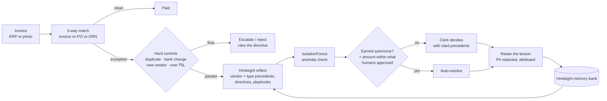

# Precedent

**An accounts-payable agent that learns from every invoice exception it resolves.**
Built on [Hindsight](https://hindsight.vectorize.io/) agent memory for HackwithHyderabad 3.0.

Every AP team re-solves the same invoice exceptions: a steel supplier that always bills freight on a
separate line, a packaging vendor that still charges the old GST rate, a utility bill that never has a
purchase order. The knowledge of how to handle them lives in senior clerks' heads. Rule-based ERP matching
flags the mismatch but can't learn the answer, and a stateless AI assistant forgets every decision.

Precedent 3-way-matches each invoice against its purchase order and goods receipt. For every exception it
recalls how the team resolved similar cases before, recommends a decision with the precedents it relied on,
and learns from the clerk's decision. When it has been right often enough for a vendor and exception type,
it earns autonomy to resolve those cases on its own. Hard financial controls never bend.

> The database records what happened. Hindsight stores what the team has learned.

## Results

We replayed 26 weeks of invoices (266 invoices, 140 exceptions, 25 vendors) twice: once with Hindsight
memory, once with the same LLM and no memory. Months 1–4 build memory; months 5–6 are the measurement window.

| Months 5–6 | Memory ON | Memory OFF |
|---|---|---|
| Recommendation matches the clerk's payment decision | **96%** | 35% |
| Exceptions resolved by the agent on its own | **55%** | 0% |
| Money wrongly approved | **0** | — |
| Cited memories relevant to the case (same vendor or exception type, weeks 1–8) | **87%** | — |

How to read these honestly:
- "Match" means the same payment outcome: pay in full, pay a corrected amount, or don't pay.
- Memory OFF can never resolve cases on its own, because autonomy requires memory-backed recommendations.
  The like-for-like comparison is 96% vs 35%.
- The replay uses a simulated clerk who follows the dataset's ground-truth decisions. The agent never sees
  that ground truth.

## The demo story

| Stage | What happens |
|---|---|
| **Day 1** | A steel supplier's invoice has a ₹3,850 freight line that isn't on the PO. With no memory the agent says *hold*. The clerk approves: "Balaji bills freight separately; our agreement covers up to ₹5,000 per trip." |
| **Week 3** | A similar invoice arrives. The agent recommends *approve* (confidence 1.00), quotes the ₹5,000 cap and cites the earlier decisions. One click, and that vendor × exception type earns autonomy. Toggle memory off and the same invoice gets a generic *hold*. |
| **Week 8** | Balaji's freight invoices are resolved automatically. Along the way the agent held a ₹7,400 freight line on its own because it exceeded the learned cap. |
| **The twist** | An invoice that looks routine asks for payment to a new bank account, and another is a resubmitted duplicate. Despite strong precedent, hard controls escalate and reject them, citing the rule they enforce and the precedent they overrode. |
| **Capture** | Photograph a paper invoice: Gemini reads it, it is matched against the PO, and it is auto-resolved in about 14 seconds. Submitting the same photo again is caught as a duplicate. |

## How it works



- **Deterministic first.** 3-way matching and four hard controls are plain Python and run before any model.
- **Memory decides.** `reflect()` answers with a typed recommendation and the exact memories, playbooks and
  directives it used. Details in [docs/HINDSIGHT.md](docs/HINDSIGHT.md).
- **LLMs return JSON only.** One OpenAI-compatible router tries Groq `gpt-oss-120b`, then Gemini
  `3.1-flash-lite`, then NVIDIA `nemotron-3-super`, with strict schemas, a repair retry and failover.
  Money arithmetic (corrected payable amounts) is done in code, never by a model.
- **Earned autonomy.** Each vendor × exception type starts in *suggest* mode, is promoted after 3
  consecutive accepted recommendations, and drops back on any overrule. Auto-approval is also capped at the
  largest amount humans have approved for that pair, and blocked when the invoice looks unusual for the vendor.

### Safety: what if someone teaches it the wrong thing?
1. Hard controls are code, and memory cannot override them.
2. Autonomy never pays more than humans have already approved for that vendor and exception type.
3. Every lesson records who taught it. `POST /api/lessons/{id}/revoke` deletes the lesson from Hindsight,
   resets that vendor × type ladder and discards recommendations built on it.
4. Personal data (phone, bank account, PAN, Aadhaar, card, email, UPI) is redacted before anything is stored.
5. Auto-resolutions are audited; a wrong one is overruled and the pair is demoted.

## Tech stack

| Layer | Choice |
|---|---|
| Memory | Hindsight Cloud (`hindsight-client`): retain, recall, reflect, tags, directives, observations, mental models, bank clones |
| API | Python 3.12, FastAPI (REST + Server-Sent Events), Pydantic v2, SQLModel + SQLite |
| Models | Groq `openai/gpt-oss-120b` → Gemini `gemini-3.1-flash-lite` → NVIDIA `nemotron-3-super-120b-a12b`; Gemini vision for invoice photos |
| ML | scikit-learn IsolationForest, per vendor |
| Frontend | Desktop-first PWA: Vite, React 19, TypeScript, Tailwind v4, shadcn/ui ([frontend/](frontend/)) |
| Push | Web Push (VAPID) |

## Run it locally

Requirements: Python 3.12 with [uv](https://docs.astral.sh/uv/), a Hindsight Cloud API key, and at least
one LLM key (Groq, Gemini or NVIDIA).

```bash
cd backend
cp .env.example .env              # add HINDSIGHT_API_KEY, GROQ_API_KEY, GEMINI_API_KEY, NVIDIA_API_KEY
uv sync
uv run python -m scripts.gen_vapid           # push-notification keys (optional)
uv run fastapi dev app/main.py               # http://localhost:8000/docs
uv run pytest                                # 26 offline tests (no network, no cost)
```

On first start the API seeds the dataset and opens **Day 1**. Demo stages switch instantly from the committed
snapshots (`POST /api/demo/advance {"stage": "week3"}`; stages: `day1`, `week3`, `week8`, `twist`).

To rebuild the demo and the evaluation from scratch (live Hindsight and LLM calls, about 20 minutes):

```bash
uv run python -m scripts.build_demo
```

The API is documented in [docs/api-contract.md](docs/api-contract.md), with a mock response for every endpoint in
[docs/mocks/](docs/mocks/).

## The data

Synthetic but built to look like a real Hyderabad manufacturer's AP ledger, generated from a fixed seed so
every run is reproducible:
- 25 vendors across 8 states with valid GSTINs (checksummed), IFSC codes and masked bank accounts
- Real HSN/SAC codes and GST 2.0 rates (5% / 18%)
- Each vendor has habits that create recurring exceptions: separate freight lines, escalation clauses,
  monsoon transit shortfalls, partial shipments billed in full, the pre-GST-2.0 rate still being charged,
  no-PO utility bills
- Traps: duplicate submissions, bank-account-change fraud attempts, a first-time vendor and invoices over
  the approval limit

The matching engine independently detects exactly the issues the generator planted, on all 266 invoices.
That check is part of the test suite.

## Repository

```
backend/
  app/
    data/        seeded dataset generator + vendor catalog
    matching/    3-way match engine
    guardrails/  hard controls
    memory/      Hindsight wrapper + PII redaction
    llm/         OpenAI-compatible router with failover
    ml/          anomaly scoring
    agent/       recommender + earned-autonomy ladder
    services/    case lifecycle, simulator, demo stages, metrics, capture, push
    api/         FastAPI routes
  scripts/       build_demo, refresh_stage, smoke, mocks, sample invoice, VAPID keys
  tests/         offline tests with a fake memory and fake LLM
  data/          demo snapshots + evaluation results
frontend/        PWA
docs/            API contract, mocks, Hindsight write-up, sample invoice
```
